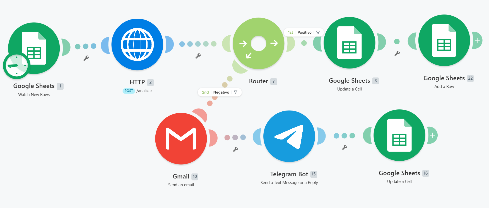
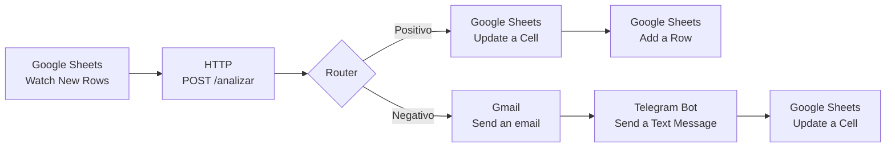

# Flujo en Make — Automatización del analizador de sentimientos

Este flujo conecta una hoja de Google Sheets con la API de análisis de sentimiento y ejecuta acciones automáticas según el resultado. La idea general es simple: cuando entra una nueva reseña, Make la envía a la API, interpreta la respuesta y decide qué hacer después.


---

## Objetivo

Automatizar el procesamiento de reseñas para que cada registro nuevo pase por este ciclo:

1. Se detecta una fila nueva en Google Sheets.
2. Se envía el texto de la reseña a la API Flask.
3. La API responde si el sentimiento es positivo o negativo.
4. Un router decide que camino coger.
5. Se actualiza la hoja, y si corresponde, se envían alertas por correo o Telegram.

---

## Escenario general

El escenario está pensado para operar sobre una hoja llamada `Reseñas Pendientes` con columnas como estas:

| Columna       | Ejemplo                                    | Uso                             |
| ------------- | ------------------------------------------ | ------------------------------- |
| `Producto     | `Telefono Iphone`                          | Identificador interno           |
| `cliente`     | `Maria Clara`                              | Nombre del autor                |
| `reseña`      | `El producto llego rapido y funciona bien` | Texto a analizar                |
| `fecha`       | `2026-05-24`                               | Fecha de ingreso                |
| `sentimiento` | vacío                                      | Resultado devuelto por la API   |

La API responde con una estructura similar a esta:

```json
{
  "sentimiento": "Positivo",
  "prediccion_original": 1
}
```

---

## Diagrama del flujo



---

## Módulos del escenario

### 1. Google Sheets - Watch New Rows

Módulo disparador que monitorea la hoja `Reseñas Pendientes`.

Configuración de ejemplo:

| Campo                 | Valor de ejemplo         |
| --------------------- | ------------------------ |
| Spreadsheet           | `/ Reseña de personas`   |
| Sheet                 | `Hoja 1`                 |
| Table contains headers| `Yes`                    |
| Rows with headers     | `A1:D1`                  |
| Limit                 | `1`                      |


Este módulo entrega la fila nueva al resto del flujo.

### 2. HTTP - POST /analizar

Envía la reseña a la API Flask instalada en el servidor.

Configuración de ejemplo:

| Campo        | Valor de ejemplo                       |
| ------------ | -------------------------------------- |
| Method       | `POST`                                 |
| URL          | `http://TU_IP_O_DOMINIO:5000/analizar` |
| Body type    | `Raw`                                  |
| Content type | `application/json`                     |

Ejemplo de cuerpo enviado:

```json
{
  "reseña": "1.Reseña (c)"
}
```
Los datos que quieres utilizar te los muestra de manera intuitiva y muestra cual es el contenido de esos datos, es lo bueno de trabajar con make.

La respuesta se usa después para decidir la ruta del router.

### 3. Router

Divide el flujo en dos caminos:

- Ruta 1: `Positivo`
- Ruta 2: `Negativo`

Los filtros pueden basarse en el campo `sentimiento` devuelto por la API o, si prefieres, en `prediccion_original`.

---

## Rama positiva

Cuando la respuesta es positiva, el flujo sigue una ruta pensada para registrar el caso como satisfactorio.

### 4. Google Sheets - Update a Cell

Actualiza la fila original con el resultado del análisis.

Ejemplo de actualización:

| Columna       | Valor                             |
| ------------- | --------------------------------- |
| `sentimiento` | `Positivo`                        |

### 5. Google Sheets - Add a Row

Agrega una copia resumida a una hoja secundaria llamada `Reseñas Positivas` para tener historial.

Ejemplo de columnas destino:

| Campo         | Valor                                      |
| ------------- | ------------------------------------------ |
| `Producto     | `Telefono Iphone`                          |
| `cliente`     | `Maria Clara`                              |
| `reseña`      | `El producto llego rapido y funciona bien` |
| `fecha`       | `2026-05-24`                               |
| `sentimiento` | `Positivo`                                     |

---

## Rama negativa

Cuando la reseña se clasifica como negativa, el objetivo es avisar rápido al equipo.

### 4. Gmail - Send an email

Envía una notificación al correo de soporte o a una cuenta interna.

Asunto de ejemplo:

`Reseña Negativa`

Cuerpo de ejemplo:

```text
Recibiste una reseña negativa, responde de inmediato

Reseña: "No me funciono y la atencion fue pesima"
Producto: "Licuadora"
Cliente: "Daniela"
Fecha: "2026-05-24"
```

### 5. Telegram Bot - Send a Text Message or a Reply

Envía un mensaje inmediato al canal de operaciones o al grupo del equipo.

Mensaje de ejemplo:

```text
Recibimos una reseña negativa, por favor atender y responder

Reseña: "No me funciono y la atencion fue pesima"
Producto: "Licuadora"
Cliente: "Daniela"
Fecha: "2026-05-24"
```

### 6. Google Sheets - Update a Cell

Marca la fila como revisada para que el equipo sepa que ya fue notificada.

Ejemplo:

| Columna       | Valor                              |
| ------------- | ---------------------------------- |
| `sentimiento` | `Negativo`                         |


---

## Cómo reproducirlo

### Requisitos previos

- Cuenta activa en Make.
- Una hoja de Google Sheets con la estructura de columnas definida.
- La API funcionando y accesible desde internet o desde la red donde corre Make.
- Conexiones autorizadas en Make para Google Sheets, HTTP, Gmail y Telegram.

### Paso 1 — Crear el escenario

1. Abre Make y crea un escenario nuevo.
2. Agrega el módulo `Google Sheets - Watch New Rows` como disparador.
3. Conecta la cuenta y selecciona la hoja donde caerán las reseñas.

### Paso 2 — Llamar a la API

1. Agrega un módulo `HTTP - Make a request`.
2. Configúralo con método `POST` y la ruta `/analizar`.
3. Mapea el texto de la reseña en el cuerpo JSON.

### Paso 3 — Separar por sentimiento

1. Agrega un `Router` después de la respuesta HTTP.
2. Crea un filtro para `Positivo`.
3. Crea otro filtro para `Negativo`.

### Paso 4 — Configurar acciones por rama

1. En la ruta positiva, actualiza la fila original y guarda el registro en la hoja de positivos.
2. En la ruta negativa, envía el correo, manda el Telegram y marca la fila como revisada.

### Paso 5 — Probar el flujo

1. Inserta una reseña de prueba en la hoja.
2. Ejecuta el escenario una vez en modo manual.
3. Verifica que la API responda y que cada ruta haga lo esperado.

---

## Criterios de prueba

El flujo se considera correcto si:

- Una fila nueva activa el escenario automáticamente.
- La API devuelve una respuesta válida para cada reseña.
- Las reseñas positivas se registran en la hoja secundaria.
- Las reseñas negativas generan alerta por correo y Telegram.
- La hoja principal queda actualizada con el estado final.

---

## Observaciones

- Si la API no es pública, Make no podrá consumirla directamente.
- Si más adelante cambian los estados del análisis, solo hay que ajustar los filtros del router.

---

## Datos de ejemplo usados en este documento

| Elemento          | Valor ficticio                         |
| ----------------- | -------------------------------------- |
| API               | `http://tu-dominio-o-ip:5000/analizar` |
| Hoja principal    | `Hoja 1`                   |
| Hoja secundaria   | `Reseñas Positivas`                    |
| Correo de alerta  | `soporte@demo.com`                     |
| Canal de Telegram | `@equipo_alertas`                      |

Estos datos existen solo para documentar el flujo. Puedes reemplazarlos por los reales cuando revises el escenario.
